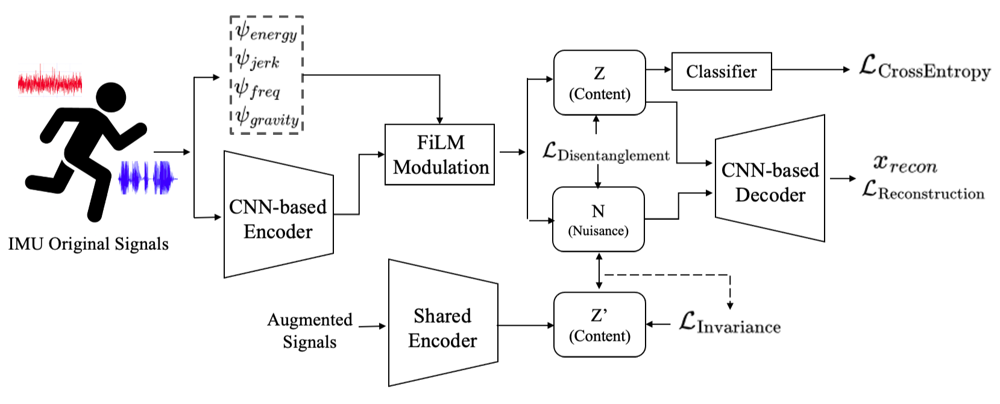

# PADR
(paper source) Robust Sensor-Based Activity Recognition via Physics-Aware Disentangled Representation Learning and FiLM Conditioning

<p align="center"></p>

This repository implements the methodology proposed in the paper "Robust Sensor-Based Activity Recognition via Physics-Aware Disentangled Representation Learning and FiLM Conditioning".

## Abstract

Sensor-based Human Activity Recognition (HAR) often breaks down in real-world deployments because models entangle intrinsic activity patterns with extrinsic nuisance factors such as sensor orientation changes and placement shifts. This work argues that reliable HAR requires explicitly separating user motion from sensor-induced artifacts. We propose a physicsaware disentanglement framework that treats such nuisance factors as interference to be suppressed rather than patterns to be modeled. First, we inject physical priors, including gravity direction and motion smoothness, via a Feature-wise Linear Modulation (FiLM) mechanism that conditions the learned latent representations with respect to physically meaningful characteristics. Second, we adopt a dual-branch architecture in which activity-relevant and nuisance-related representations are explicitly separated by minimizing the Hilbert–Schmidt Independence Criterion (HSIC). Experiments on four public wearable HAR benchmarks show that the proposed method substantially improves robustness to sensor rotation, signal distortions, and other perturbations, while preserving high recognition accuracy and computational efficiency compared with baseline models.

## Datasets

The system works with four popular HAR datasets.

1. **UCI HAR Dataset**: Contains data from smartphone sensors for 6 activities.
   - Download: https://archive.ics.uci.edu/ml/datasets/human+activity+recognition+using+smartphones

2. **WISDM Dataset**: Contains accelerometer data from smartphones for 6 physical activities.
   - Download: https://www.cis.fordham.edu/wisdm/dataset.php

3. **PAMAP2 Dataset**: Physical Activity Monitoring dataset with data from 18 different physical activities. (At this 12.)
   - Download: https://archive.ics.uci.edu/ml/datasets/pamap2+physical+activity+monitoring

4. **mHealth Dataset**: Contains data from body-worn sensors for 12 physical activities.
   - Download: https://archive.ics.uci.edu/ml/datasets/mhealth+dataset

## Requirements

The following libraries are required:

```
torch>=1.12.0
numpy>=1.21.0
pandas>=1.3.0
scikit-learn>=1.0.0
scipy>=1.7.0
requests>=2.25.0
thop>=0.1.1
mlxtend>=0.21.0
```

You can install all required packages using:

```bash
pip install -r requirements.txt
```

## Citing this Repository

If you use this code in your research, please cite:

```
@article{PADR,
  title = {Robust Sensor-Based Activity Recognition via Physics-Aware Disentangled Representation Learning and FiLM Conditioning},
  author={Gyuyeon Lim and Myung-Kyu Yi}
  journal={},
  volume={},
  Issue={},
  pages={},
  year={}
  publisher={}
}
```

## Contact

For questions or issues, please contact:
- Gyuyeon Lim : lky473736@gmail.com
